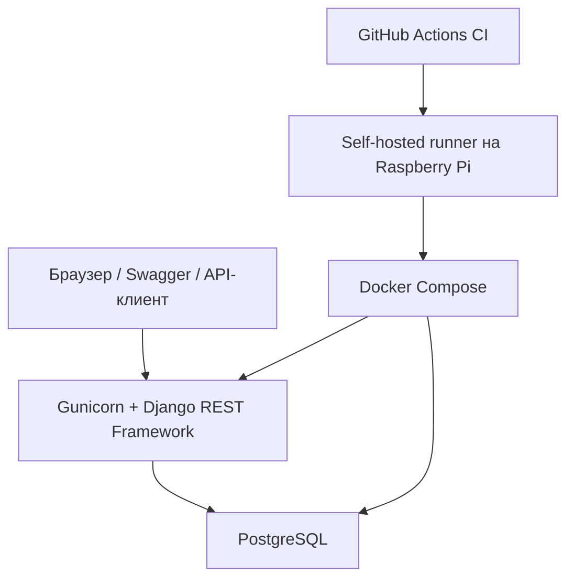
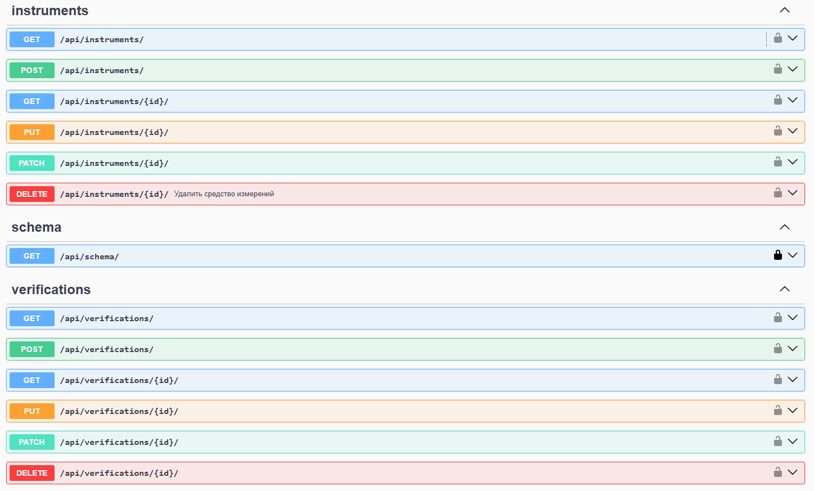
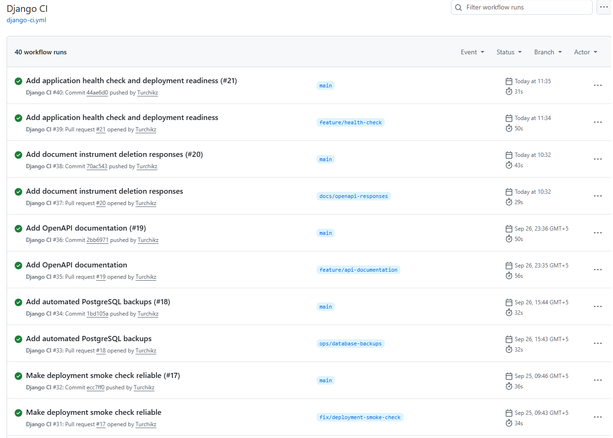
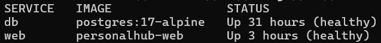

# PersonalHub

[](https://github.com/Turchikz/PersonalHub/actions/workflows/django-ci.yml)

PersonalHub — учебный Django-проект с REST API для автоматизации повседневных задач. Текущий модуль `metrology` предназначен для учёта средств измерений и истории их поверок.

Проект используется для практического изучения backend-разработки, тестирования API, PostgreSQL, Docker и CI/CD. Приложение автоматически тестируется через GitHub Actions и развёртывается на Raspberry Pi 5.

## Возможности

- создание, просмотр и изменение средств измерений;
- ведение истории поверок;
- фильтрация приборов по статусу и функциональному узлу;
- фильтрация поверок по средству измерений;
- проверка дат поверки;
- автоматическая очистка позиции при переводе прибора из статуса `WORK`;
- защита от удаления прибора со связанными поверками;
- разграничение прав для анонимных, обычных и административных пользователей;
- интерактивная документация Swagger UI;
- OpenAPI-схема;
- endpoint проверки состояния приложения и PostgreSQL;
- автоматические тесты моделей, сериализаторов и API;
- автоматическая проверка pull request;
- автоматический деплой на Raspberry Pi;
- резервное копирование PostgreSQL с проверкой целостности архива.

## Бизнес-правила

### Средство измерений

- позиция обязательна для прибора в статусе `WORK`;
- при статусах `SPARE`, `REPAIR` и `VERIFICATION` позиция автоматически очищается;
- позиционное обозначение должно быть уникальным;
- сочетание типа/модели и заводского номера должно быть уникальным;
- пробелы по краям позиции удаляются.

### Поверка

- дата поверки не может быть позже текущей даты;
- дата окончания должна быть позже даты поверки;
- следующая плановая поверка необязательна;
- если следующая поверка указана, она должна быть позже даты поверки;
- прибор со связанными поверками нельзя удалить;
- при попытке такого удаления API возвращает `409 Conflict`.

## Стек

### Backend

- Python;
- Django;
- Django REST Framework;
- django-filter;
- drf-spectacular;
- Gunicorn;
- WhiteNoise.

### База данных

- PostgreSQL;
- psycopg.

### Тестирование

- pytest;
- pytest-django;
- Django Test Client;
- DRF APIClient.

### Инфраструктура

- Docker;
- Docker Compose;
- GitHub Actions;
- self-hosted runner;
- Raspberry Pi 5 с Ubuntu Server;
- systemd для планирования резервного копирования.

## Архитектура



## Демонстрация

### Swagger UI

Интерактивная документация позволяет просматривать API и вручную отправлять запросы.



### GitHub Actions

Каждый pull request проходит проверку конфигурации Django, миграций, OpenAPI-схемы и автоматических тестов.



### Docker Compose

Приложение и PostgreSQL запущены в контейнерах и контролируются healthcheck.



## API

| Ресурс | Адрес | Фильтры |
| --- | --- | --- |
| Средства измерений | `/api/instruments/` | `status`, `functional_unit` |
| Поверки | `/api/verifications/` | `instrument` |
| OpenAPI-схема | `/api/schema/` | — |
| Swagger UI | `/api/docs/` | — |
| Проверка состояния | `/health/` | — |

Примеры запросов:

```http
GET /api/instruments/?status=WORK
GET /api/instruments/?functional_unit=BIK&status=WORK
GET /api/verifications/?instrument=1
GET /health/
```

## Коды ответа

| Код | Назначение |
| --- | --- |
| `200 OK` | успешное получение или изменение данных |
| `201 Created` | запись успешно создана |
| `204 No Content` | запись успешно удалена |
| `400 Bad Request` | данные не прошли валидацию |
| `401 Unauthorized` | требуется аутентификация |
| `403 Forbidden` | недостаточно прав |
| `404 Not Found` | объект не найден |
| `409 Conflict` | прибор нельзя удалить из-за связанных поверок |
| `503 Service Unavailable` | приложение не может подключиться к PostgreSQL |

## Документация API

После запуска приложения Swagger UI доступен по адресу:

```text
http://127.0.0.1:8000/api/docs/
```

OpenAPI-схема:

```text
http://127.0.0.1:8000/api/schema/
```

Swagger позволяет просматривать доступные операции, структуры запросов и ответов, а также вручную отправлять HTTP-запросы.

Запросы из Swagger отправляются в настоящую базу текущего окружения. Swagger UI не является отдельной тестовой средой.

## Запуск через Docker

Клонируйте репозиторий:

```powershell
git clone https://github.com/Turchikz/PersonalHub.git
cd PersonalHub
```

Создайте локальный `.env` на основании примера:

```powershell
Copy-Item .env.example .env
```

Укажите необходимые значения переменных окружения в `.env`, затем запустите сервисы:

```powershell
docker compose config --quiet
docker compose up -d --build --wait --wait-timeout 120
```

Проверьте состояние контейнеров:

```powershell
docker compose ps
```

Проверьте приложение:

```powershell
curl.exe http://127.0.0.1:8000/health/
```

Ожидаемый ответ:

```json
{
  "status": "ok",
  "database": "avaliable"
}
```

Остановка контейнеров:

```powershell
docker compose down
```

Данные PostgreSQL сохраняются в Docker volume.

## Запуск без Docker

Для локального запуска потребуется доступный экземпляр PostgreSQL и заполненный `.env`.

```powershell
py -m venv .venv
.\.venv\Scripts\Activate.ps1
python -m pip install --upgrade pip
python -m pip install -r requirements.txt
python manage.py migrate
python manage.py runserver
```

## Тестирование

Запуск всех тестов локально:

```powershell
python -m pytest -v
```

Запуск тестов внутри контейнера:

```powershell
docker compose exec web python -m pytest -v
```

Дополнительные проверки:

```powershell
python manage.py check
python manage.py makemigrations --check --dry-run
python manage.py spectacular --file schema.yml --validate
```

Тесты покрывают:

- бизнес-логику моделей;
- валидацию сериализаторов;
- создание, чтение, изменение и удаление через API;
- фильтрацию;
- права доступа;
- защиту связанных данных;
- OpenAPI-документацию;
- health-check и обработку недоступности базы.

Для тестов, использующих базу данных, pytest создаёт отдельную тестовую базу и удаляет её после завершения тестовой сессии.

## CI/CD

При создании pull request и отправке изменений в `main` GitHub Actions выполняет:

1. установку зависимостей;
2. проверку конфигурации Django;
3. проверку отсутствующих миграций;
4. валидацию OpenAPI-схемы;
5. запуск автоматических тестов.

После успешного объединения изменений с `main` self-hosted runner на Raspberry Pi:

1. получает актуальный код;
2. собирает Docker-образ;
3. запускает сервисы через Docker Compose;
4. ожидает состояния `healthy`;
5. выполняет smoke-проверку `/health/`.

## Резервное копирование

PostgreSQL автоматически архивируется скриптом:

```text
scripts/backup_postgres.sh
```

Планирование выполняется через systemd timer.

Перед сохранением архив проверяется командой `pg_restore --list`. Незавершённый или повреждённый временный файл не заменяет готовую резервную копию.

Срок хранения архивов — 180 дней.

## Структура проекта

```text
PersonalHub/
├── config/                  # настройки Django и health-check
├── dashboard/               # главная страница
├── metrology/               # приборы, поверки и REST API
├── deploy/systemd/          # unit-файлы резервного копирования
├── scripts/                 # служебные скрипты
├── .github/workflows/       # CI/CD
├── compose.yaml
├── Dockerfile
├── manage.py
└── requirements.txt
```

## Реализованные практические навыки

В ходе проекта были применены:

- анализ требований и формализация бизнес-правил;
- классы эквивалентности и граничные значения;
- тестирование Django-моделей;
- тестирование сериализаторов;
- тестирование REST API;
- фикстуры и параметризация pytest;
- mock для проверки ошибочных сценариев;
- SQL и PostgreSQL;
- Git, ветки и pull request;
- Docker и Docker Compose;
- CI/CD через GitHub Actions;
- документирование API через OpenAPI;
- развёртывание приложения на Raspberry Pi;
- резервное копирование и тестовое восстановление PostgreSQL.

## Web Monitor

Мониторинг Rozetked каждые 15 минут, предполагаемый режим белых списков,
история и уведомления на главной странице: [настройка и запуск](docs/web-monitor.md).
